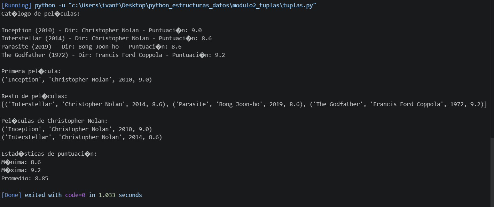
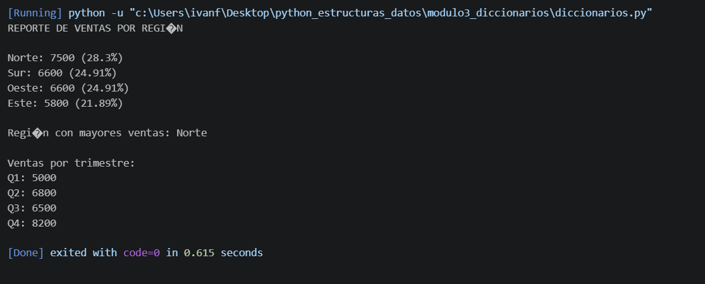
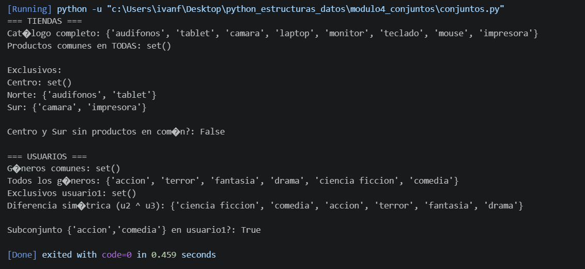
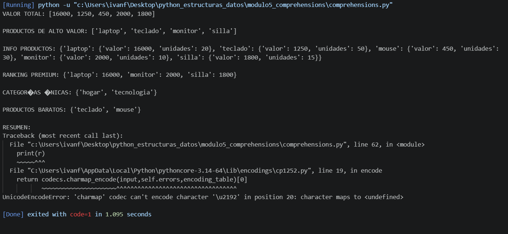

# Proyecto: Estructuras de Datos en Python

## Descripción del proyecto

Este proyecto consiste en la resolución de una serie de retos prácticos en Python, enfocados en el uso de estructuras de datos fundamentales: listas, tuplas, diccionarios, conjuntos (sets) y comprehensions.

Cada módulo desarrolla un problema aplicado que permite entender cómo almacenar, manipular y analizar datos de manera eficiente. Los ejercicios incluyen casos como gestión de inventarios, análisis de ventas, catálogos de películas y comparación de datos.

El objetivo principal es fortalecer la lógica de programación mediante el uso adecuado de cada estructura según el problema planteado.

## Temas aprendidos
>#### Módulo 1: Listas
>- Creación y acceso ([], list()) 
>- Índices positivos y negativos
>- Métodos: append(), insert(), extend()
>- Eliminación: remove(), pop(), clear()
>- Ordenamiento: sort(), reverse(), sorted()
>- Slicing (lista[inicio:fin:paso])
>- Recorridos con for, range, enumerate
>- Copias (copy(), slicing)

>#### Módulo 2: Tuplas
>- Inmutabilidad
>- Creación ((), tuple(), comas)
>- Acceso y slicing
>- Métodos: count(), index()
>- Desempaquetado básico y avanzado (*resto)
>- Retorno múltiple de funciones

>#### Módulo 3: Diccionarios
>- Estructura clave-valor
>- Creación ({}, dict(), zip)
>- Métodos: get(), update(), pop()
>- Iteración con items(), values(), keys()
>- Diccionarios anidados
>- Comprensiones de diccionario

>#### Módulo 4: Sets (Conjuntos)
>- Elementos únicos y no ordenados
>- Creación (set(), {})
>- Métodos: add(), update(), remove(), discard()
>- Operaciones:
>    - Unión (union(), |)
>    - Intersección (intersection(), &)
>    - Diferencia (difference(), -)
>    - Diferencia simétrica (^)
>- Verificación: isdisjoint(), subconjuntos (<=)

>#### Módulo 5: Comprehensions
>- List comprehension
>- Dict comprehension
>- Set comprehension
>- Uso de filtros (if)
>- Optimización y legibilidad del código
>- Uso combinado en análisis de datos
>

## Evidencia de retos resueltos

#### Módulo 1: Gestión de inventario

Se implementa un sistema de inventario utilizando listas anidadas. Se realizan operaciones como actualización de precios, registro de ventas y adición de nuevos productos. Se evidencia el uso de métodos de listas y manipulación directa de datos.

#### Módulo 2: Sistema de películas

Se construye un catálogo usando tuplas, destacando su inmutabilidad. Se aplican técnicas de desempaquetado y se implementan funciones para búsqueda y cálculo de estadísticas como promedio, mínimo y máximo.

#### Módulo 3: Análisis de ventas por región

Se trabaja con diccionarios anidados para almacenar ventas trimestrales. Se calculan totales por región, se identifica la región con mayores ventas y se generan porcentajes. Se utiliza iteración y funciones como max() y sorted().

#### Módulo 4: Tiendas y recomendaciones

Se utilizan conjuntos para representar catálogos de productos y preferencias de usuarios. Se aplican operaciones de teoría de conjuntos como unión, intersección y diferencia para comparar datos y obtener resultados relevantes.

#### Módulo 5: Analizador de ventas

Se implementan list, dict y set comprehensions para transformar y filtrar datos de ventas. Se generan estructuras derivadas, se calcula el total general y se construyen reportes de forma concisa.

## Capturas de ejecución

#### Módulo 1

Se muestra la ejecución del sistema de inventario donde se actualiza el precio de un producto, se registra una venta y se añade un nuevo producto. Finalmente, se imprime el inventario actualizado con los cambios reflejados.

#### Módulo 2

Se visualiza el catálogo de películas impreso en consola, junto con los resultados de la búsqueda por director y las estadísticas calculadas (mínimo, máximo y promedio de puntuaciones).

#### Módulo 3

Se observa el reporte de ventas por región, incluyendo el total por cada una, el porcentaje respecto al total general y la identificación de la región con mayores ventas.

#### Módulo 4

Se presentan los resultados de las operaciones entre conjuntos, como productos comunes, exclusivos y el catálogo completo. También se muestran las comparaciones entre preferencias de usuarios.

#### Módulo 5

Se evidencia el uso de comprehensions mostrando listas de valores totales, productos filtrados, estructuras tipo diccionario y conjuntos únicos, junto con el cálculo del total general.

## Reflexión personal del aprendizaje

Durante el desarrollo de este proyecto se logró comprender el funcionamiento y la importancia de las diferentes estructuras de datos en Python.

Las listas permitieron trabajar con datos dinámicos y modificables, mientras que las tuplas mostraron la utilidad de estructuras inmutables para mantener la integridad de la información. Los diccionarios facilitaron la organización de datos en pares clave-valor, lo que resulta muy útil en contextos reales.

Por su parte, los conjuntos ofrecieron una forma eficiente de trabajar con datos únicos y realizar comparaciones rápidas. Finalmente, las comprehensions permitieron escribir código más claro, conciso y eficiente para la manipulación de datos.

En conclusión, este proyecto contribuyó al fortalecimiento de la lógica de programación y al uso adecuado de cada estructura de datos según el problema a resolver.
